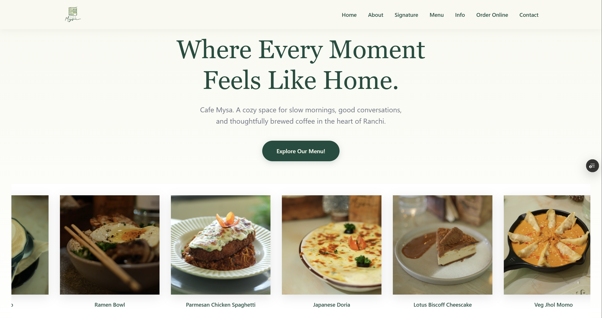

<div align="center">

# ☕ Cafe Mysa - Official Website

### _Where Every Moment Feels Like Home_



_A modern, responsive website for Cafe Mysa - Ranchi's premier continental café offering artisanal coffee, delicious food, and a cozy ambiance._

[View Live Site](https://cafe-mysa.vercel.app/) • [Report Bug](https://github.com/anirxddh/CafeMysa/issues) • [Request Feature](https://github.com/anirxddh/CafeMysa/issues)

</div>

---

## 📖 Table of Contents -

- [About The Project](#-about-the-project)
- [Features](#-features)
- [Tech Stack](#-tech-stack)
- [Project Structure](#-project-structure)
- [Getting Started](#-getting-started)
- [Design Philosophy](#-design-philosophy)
- [Responsiveness](#-responsiveness)
- [Performance Optimizations](#-performance-optimizations)
- [Credits & Acknowledgments](#-credits--acknowledgments)
- [License](#-license)
- [Contact](#-contact)

---

## 🎯 About The Project:

**Cafe Mysa** is a beloved café in Ranchi, Jharkhand, known for its warm atmosphere, continental cuisine, and specialty coffee. This website serves as the digital home for the café, providing visitors with an immersive experience that reflects the café's cozy and welcoming environment.

### Why This Project?

The goal was to create a **premium, calm, and aesthetically pleasing** web presence that:

- Showcases the café's signature dishes and beverages.
- Provides essential information (location, hours, menu).
- Enables seamless online ordering through delivery platforms.
- Reflects the café's brand identity with a clean, modern design.
- Offers an exceptional user experience across all devices.

---

## ✨ Features:

### 🎨 **Visual & Interactive Elements**

- **Loading Screen** - Welcoming "Johar!" animation with smooth fade transitions.
- **Infinite Image Carousel** - Horizontally scrolling strip showcasing signature dishes and drinks with pause-on-hover functionality.
- **Scroll Reveal Animations** - Elements fade in smoothly as users scroll through the page.
- **Hover Effects** - Interactive cards and buttons with smooth scale and shadow transitions.
- **Parallax Scrolling** - Subtle parallax effect on hero section for depth.

### 📱 **Responsive Navigation**

- **Fixed Navbar** - Stays at the top for easy navigation.
- **Mobile Hamburger Menu** - Smooth toggle with animated icon.
- **Smooth Scroll** - Seamless transitions between sections.
- **Active State** - Visual feedback on navigation items.

### 🍽️ **Content Sections**

1. **Hero Section** - Eye-catching headline with call-to-action.
2. **About Us** - Story of Cafe Mysa and its mission.
3. **Signature Items** - Showcase of signature dishes and drinks with icons.
4. **Menu Section** - Three downloadable PDF menus (Breakfast, Full Menu, Sips of Mysa).
5. **Cafe Info** - Opening hours and daily serving statistics.
6. **Order Online** - Quick links to Zomato, Swiggy, EasyDiner, and District.
7. **Contact & Location** - Google Maps embed, WhatsApp contact, social media links.

### 🎯 **User Experience**

- **One-Click Ordering** - Direct links to delivery platforms.
- **PDF Menu Viewing** - Downloadable menu files.
- **WhatsApp Integration** - Instant contact via WhatsApp.
- **Social Media Links** - Instagram and Facebook buttons.
- **Google Maps** - Embedded map for easy navigation.

---

## 🛠️ Tech Stack:

This project is built with **pure vanilla web technologies** - no frameworks or libraries needed!

| Technology            | Purpose                                    |
| --------------------- | ------------------------------------------ |
| **HTML5**             | Semantic markup and structure              |
| **CSS3**              | Styling, animations, and responsive design |
| **JavaScript (ES6+)** | Interactive features and animations        |
| **Vercel**            | Hosting and deployment                     |

### Why Vanilla JavaScript?

- **Zero Dependencies** - No bloated libraries.
- **Fast Loading** - Minimal file sizes.
- **Full Control** - Custom animations and interactions.
- **Easy Maintenance** - Simple codebase.
- **Better Performance** - Optimized for speed.

---

## 📁 Project Structure:

```
cafe-mysa-website/
│
├── index.html              # Main HTML file
├── css/
│   └── style.css          # All styles and animations
├── js/
│   └── script.js          # Interactive functionality
├── assets/
│   ├── Cafe Mysa_Final-01.svg    # Logo (Light)
│   ├── instagram-logo.svg         # Instagram icon
│   ├── facebook-logo.svg          # Facebook icon
│   └── landing-page-screenshot.png # Preview image
├── icons/
│   ├── breakfast-menu.svg         # Menu icons
│   ├── mainmenu.svg
│   ├── sips-logo.svg
│   ├── whatsapplogo.svg
│   ├── clock.svg
│   ├── servingpeople.svg
│   ├── pasta.svg
│   ├── pizza-slice.svg
│   ├── coffee.svg
│   └── ... (other SVG icons)
├── images/
│   ├── Cappuccino.JPG
│   ├── ChickenSpaghetti.JPG
│   ├── Japanese_Doria.JPG
│   └── ... (food images)
└── README.md              # Project documentation
```

---

## 🚀 Getting Started:

### Prerequisites:

You only need a modern web browser! No installations required.

### Local Development:

1. **Clone the repository**

   ```bash
   git clone https://github.com/anirxddh/CafeMysa.git
   cd CafeMysa
   ```

2. **Open in browser**

   ```bash
   # Simply open index.html in your browser
   # OR use a local server (recommended):

   # Using Python
   python -m http.server 8000

   # Using Node.js
   npx http-server
   ```

3. **View the site**
   ```
   Open http://localhost:8000 in your browser
   ```

### Deployment:

The site is deployed on **Vercel** for optimal performance:

```bash
# Install Vercel CLI (optional)
npm i -g vercel

# Deploy
vercel
```

Or simply push to GitHub and connect to Vercel for automatic deployments!

---

## 🎨 Design Philosophy:

### Color Palette:

The website uses Cafe Mysa's brand colors:

| Color            | Hex Code  | Usage                              |
| ---------------- | --------- | ---------------------------------- |
| **Dark Green**   | `#1a4d3e` | Primary brand color, headers, text |
| **Medium Green** | `#9fb968` | Accent color, buttons, highlights  |
| **Light Green**  | `#d3daa3` | Secondary highlights, backgrounds  |
| **Cream**        | `#f8f9f0` | Main background                    |
| **White**        | `#ffffff` | Card backgrounds                   |
| **Black**        | `#0a0a0a` | Body text                          |

### Typography:

- **Primary Font**: Georgia, serif - For elegant headings.
- **Secondary Font**: System fonts (San Francisco, Segoe UI) - For clean body text.

### Design Principles:

✅ **Minimalism** - Clean layouts with ample white space.  
✅ **Consistency** - Unified spacing, colors, and typography.  
✅ **Accessibility** - High contrast ratios and keyboard navigation.
✅ **Performance** - Optimized animations and lazy loading.
✅ **Mobile-First** - Designed for mobile, enhanced for desktop.

---

## 📱 Responsiveness:

The website is fully responsive across all devices:

### Breakpoints:

| Device      | Viewport Width | Layout                           |
| ----------- | -------------- | -------------------------------- |
| **Mobile**  | ≤ 480px        | Single column, stacked elements  |
| **Tablet**  | 481px - 768px  | Adjusted grid, optimized spacing |
| **Desktop** | > 768px        | Full multi-column layout         |

### Responsive Features:

- **Flexible Grid System** - Auto-adjusting layouts.
- **Fluid Typography** - `clamp()` for responsive font sizes.
- **Mobile Navigation** - Hamburger menu for small screens.
- **Touch-Friendly** - Large tap targets (44px minimum).
- **Optimized Images** - Responsive image containers.

---

## ⚡ Performance Optimizations:

### Speed Enhancements:

- **No External Dependencies** - Zero framework overhead.
- **Optimized Animations** - CSS transforms and GPU acceleration.
- **Throttled Scroll Events** - RequestAnimationFrame for smooth scrolling.
- **Lazy Loading Ready** - Prepared for image lazy loading.
- **Minimal JavaScript** - Only what's necessary.

### Lighthouse Scores (Target):

- **Performance**: 95+
- **Accessibility**: 100
- **Best Practices**: 100
- **SEO**: 100

---

## 🎓 Key Learnings:

This project helped develop skills in:

- ✅ **Pure CSS Animations** - Keyframes, transitions, and transforms.
- ✅ **Vanilla JavaScript** - DOM manipulation without jQuery.
- ✅ **Responsive Design** - Mobile-first approach.
- ✅ **UI/UX Design** - Creating intuitive user experiences.
- ✅ **Performance Optimization** - Writing efficient code.
- ✅ **Cross-Browser Compatibility** - Testing across browsers.

---

## 🙏 Credits & Acknowledgments:

### Design & Development:

- **Designed & Developed by**: [Aniruddha Dey](https://github.com/anirxddh)

### Assets & Resources:

- **Icons**: [Flaticon](https://www.flaticon.com/) - SVG icons for menu, social media, and features.
- **Delivery Platform Logos**: Respective trademark owners (Zomato, Swiggy, EasyDiner, District).
- **Cafe Mysa Branding**: Official brand assets from Cafe Mysa.
- **Fonts**: System fonts and Google Fonts.
- **Hosting**: [Vercel](https://vercel.com/)

### Special Thanks:

- **Cafe Mysa Team** - For trusting me with their digital presence.
- **Beta Testers** - Friends and family who provided valuable feedback.

---

## 📄 License:

This project is created for **Cafe Mysa** and is not open for commercial reuse without permission.

For inquiries: Contact [Aniruddha Dey](https://github.com/anirxddh)

--

### Developer & Designer:

Feel free to support me on the respective platforms, most of them are still a work in progress for uploading and building Portfolio :D.

- **GitHub**: [@anirxddh](https://github.com/anirxddh)
- **LinkedIn**: [Aniruddha Dey](https://www.linkedin.com/in/aniruddha-dey/)
- **X**: [Aniruddha Dey](https://x.com/anirxddh)
- **Behance**: [Aniruddha Dey](https://www.behance.net/anirxddh)
- **Dribble**: [Aniruddha Dey](https://dribbble.com/anirxddh)

### Small Journal for Myself:

This project was what I call, my first proper full fledged commercial as well as frontend coding experience, hours of de-bugging, asking AIs where am I doing wrong, frustrating 2 AM issues when it was just another missing bracket XD etc. This was completely traditionally coded, I decided to end up doing it manually since it was just frontend, took me weeks to finish it but finally it's done.

This project taught me a lot about the Mobile Responsiveness & Javascript. Some places when I felt I should give up and shift to vibecoding the entire thing, I felt like it would be much faster but I won't be able to learn what am I trying to in the first place.

Well, I guess this was all for what I wanted to say after finishing this project.

A massive thank you to Cafe Mysa for entrusting me with such a big project. Thanks to my family as well since they gave me a lot of ideas on how to make it clean and simple!

If you are reading this, have a great day/night and please feel free to star it :D. Cheers!

---

## 🌟 Show Your Support

If you like this project, please give it a ⭐ on GitHub!

Visit [Cafe Mysa](https://cafe-mysa.vercel.app/) and experience the warmth yourself! ☕

---

<div align="center">

### Made with 💌 by Aniruddha Dey.

**Cafe Mysa** - _Where Every Moment Feels Like Home_

</div>
